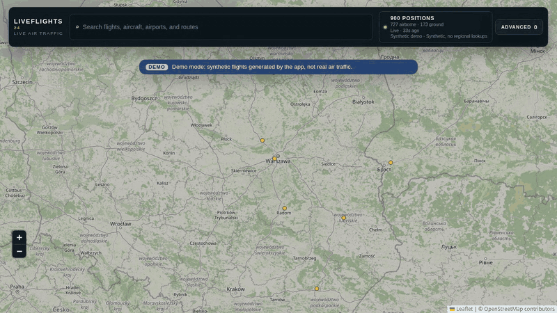
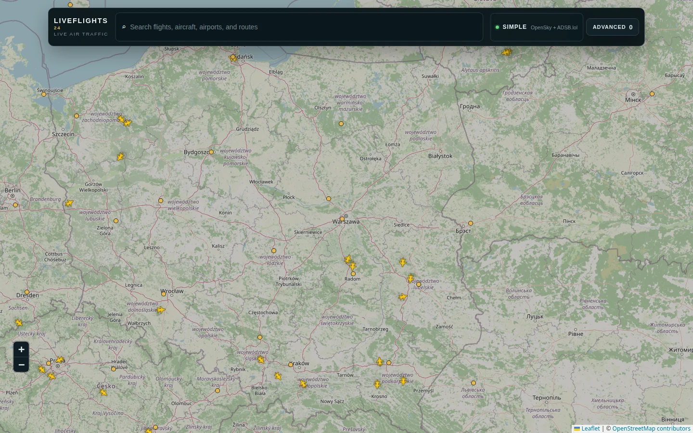
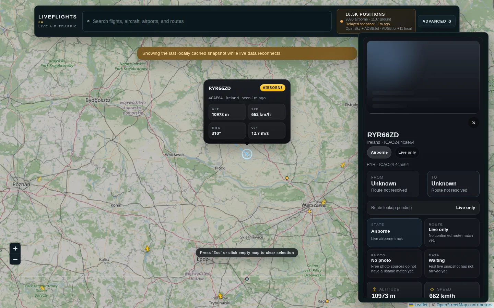
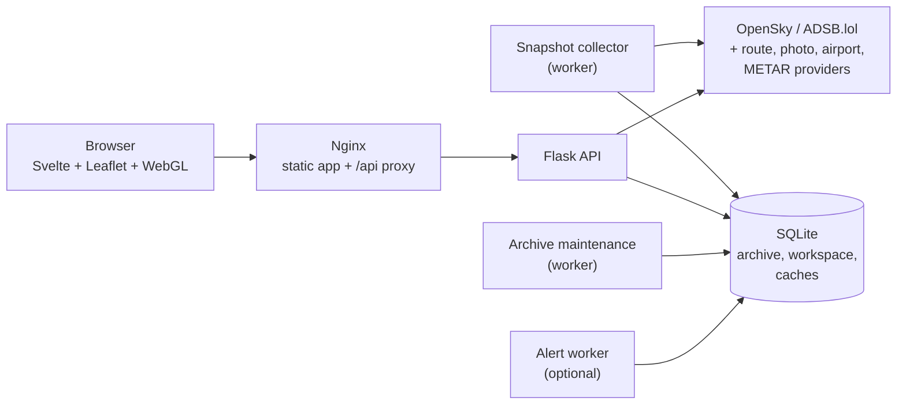

# Live Flights Map

**A self-hosted live air-traffic map: real aircraft positions from public ADS-B feeds, flight and airport details, and replay of recent traffic from a local archive.**

[](https://github.com/MaciejZiel/live_flights_map/actions/workflows/ci.yml)
[](LICENSE)




*Demo mode: live map, then the replay timeline playing back the archive. The aircraft are synthetic.*

No API keys are needed: `docker compose up` starts the app against OpenSky's anonymous API with ADSB.lol as a fallback. OpenSky OAuth2 credentials are optional and only raise the polling rate.

## What it does

- **Live map** of aircraft from OpenSky, with ADSB.lol as a fallback, rendered with Leaflet and a WebGL overlay when thousands of aircraft are in view.
- **Flight and airport inspection**: callsign, registration, best-effort route, photos, position trail, airport dashboards with METAR weather and CSV export.
- **Search** by callsign, ICAO24, registration, airline, route, airport or place, plus filters for altitude, speed, aircraft type and activity.
- **History**: a background collector writes snapshots to SQLite, which powers aircraft trails, airport movement history and a replay timeline.
- **Local workspace**: saved views, watchlists, notes and browser/webhook alerts stored per local profile.

The full list is in [FEATURES.md](FEATURES.md).





## Architecture



Each box is a separate Docker Compose service built from the same backend image. The API and workers share one Docker volume, so the API can answer most map requests from the collector's latest snapshot instead of calling a provider per browser request. `/health` reports provider, collector, archive and cache state.

## Tech stack

- **Backend:** Python 3.12, Flask 3, `requests`, SQLite (WAL mode), server-sent events
- **Frontend:** Svelte 5, Vite 6, Leaflet with marker clustering, a custom WebGL layer for dense traffic
- **Infrastructure:** Docker Compose (API, frontend, collector, archive maintenance, optional alert worker), Nginx
- **Testing:** `unittest` (backend), `node:test` (frontend utilities), Playwright (browser flows), GitHub Actions

## Quick start

Docker Engine and the Docker Compose plugin are required.

```bash
git clone https://github.com/MaciejZiel/live_flights_map.git
cd live_flights_map
docker compose up --build -d
```

Open <http://localhost:5174>. The first global snapshot appears after the collector's first run, usually within a minute. Run `docker compose down` to stop.

## Demo mode

Demo mode runs the whole app in one container with **synthetic traffic**, so it can be deployed publicly without API keys and without redistributing third-party flight data.

```bash
docker compose -f compose.demo.yaml up --build -d
# open http://localhost:8080
```

What `DEMO_MODE=true` changes:

- **Data:** the only flight provider is a built-in generator (`backend/services/demo_traffic.py`). A seeded fleet of 900 aircraft flies between real airport locations on great-circle routes with climb, cruise and descent. Positions depend only on time, so every instance shows the same sky. Callsigns start with `DEMO`, registrations with `SYN-`, the origin country is `Synthetic`, and the UI shows a *Demo* banner.
- **Replay:** on start the archive is backfilled with 90 minutes of snapshots, and a background thread adds one every 30 s, so the replay timeline works immediately without separate workers.
- **Read-only:** every non-GET API request returns `403`, the SSE stream is disabled, and flight details are answered locally. Route, photo and metadata providers are never called, and the photo proxy allows no hosts. The only outbound requests are for the public-domain OurAirports catalog and METAR weather.
- **Rate limiting:** a per-client sliding window (`DEMO_RATE_LIMIT_PER_MINUTE`, default 240) and a global backstop (`DEMO_GLOBAL_RATE_LIMIT_PER_MINUTE`, default 3000). Both return `429` with `Retry-After`. Set `DEMO_TRUST_PROXY_HEADERS=true` behind a PaaS proxy so the client IP is read from `X-Forwarded-For`.
- **Serving:** `Dockerfile.demo` builds the frontend and serves it from Flask under gunicorn (one worker, eight threads), so Nginx is not needed.

Other settings: `DEMO_FLIGHT_COUNT`, `DEMO_SEED`, `DEMO_SNAPSHOT_INTERVAL_SECONDS`, `DEMO_BACKFILL_MINUTES`.

**Why the traffic is synthetic rather than recorded.** The collector's output can't be freely redistributed. OpenSky offers its API "for research and non-commercial purposes" under its own [terms and data license](https://opensky-network.org/about/terms-of-use), which do not grant a public redistribution right. ADSB.lol data is [ODbL 1.0](https://www.adsb.lol/docs/open-data/api/) (share-alike, with attribution). So the demo bundles no recorded traffic: every position is generated from the seed when the app runs. Only airport coordinates and codes are real, used as route endpoints.

### Deploy the demo to Render

[](https://render.com/deploy?repo=https://github.com/MaciejZiel/live_flights_map)

The button reads [`render.yaml`](render.yaml): one free Docker web service built from `Dockerfile.demo` with demo mode enabled.

1. Sign in to [Render](https://render.com) and connect your GitHub account (Render asks for access to this repository).
2. Click **Deploy to Render** above, or go to **New > Blueprint** and pick this repository. Render detects `render.yaml`.
3. Keep the service name `live-flights-map-demo` (or change it), check that the plan is **Free**, and click **Apply**.
4. Wait for the first build (about 3 to 5 minutes). The app is then at `https://<service-name>.onrender.com`, and `/health` should report `"demo_mode": true`.
5. Optional: change `DEMO_FLIGHT_COUNT` or the rate limits under **Environment**. Pushing to `master` redeploys automatically (`autoDeploy`).

Free Render services sleep after 15 minutes without traffic and take up to a minute to wake. The free plan has no persistent disk, so the archive is rebuilt (backfilled) on each start, which is all the demo needs. To keep history across restarts, switch to a paid plan and uncomment the `disk` block in `render.yaml`.

## Tests

```bash
# Backend: 104 unittest tests
python -m unittest discover -s backend/tests -v

# Frontend: 63 unit tests, production build, 4 Playwright browser flows
cd frontend
npm ci
npm test
npm run build
npx playwright install chromium
npm run test:e2e
```

The backend tests can also run inside the image: `docker compose run --rm --no-deps api python -m unittest discover -s backend/tests -v`. GitHub Actions runs all of the above on every push and pull request. The Playwright flows mock the API responses, so CI does not depend on live feeds.

## Key technical decisions

- **One collector instead of per-user provider calls.** OpenSky limits anonymous clients heavily, so a separate worker fetches one global snapshot on a schedule (every 20 minutes anonymously, 3 minutes with OAuth2) and stores it in SQLite. The API serves map requests from that snapshot and only adds a small, rate-capped ADSB.lol area request (max 25 square degrees, one per 30 s shared across clients) when the user zooms in. The cost is freshness: anonymous data can be several minutes old, so the UI marks positions as delayed instead of presenting them as live.
- **Provider chain with explicit cooldowns.** Providers sit behind a small `FlightProvider` protocol. Rate-limit errors carry the upstream `Retry-After` value, the provider is put on cooldown, and the next provider or the last cached snapshot is used. Every response says which source it came from and how old it is.
- **SQLite instead of a database server.** The archive, workspace profiles and caches are SQLite files on a shared volume, with WAL mode so the API can read while the collector writes. This keeps the app a single `docker compose up` with no extra service, at the cost of horizontal scaling. Retention (24 h / 720 snapshots by default) is enforced by a maintenance worker.
- **Rendering mode chosen by density.** Thousands of Leaflet DOM markers make the map slow, so the frontend switches between detailed markers, a lighter marker mode and a WebGL overlay depending on aircraft count and zoom (`frontend/src/lib/utils/mapPerformance.js`), and only processes aircraft in the visible map area.

## Limitations / next steps

- Data quality is whatever the public feeds provide. Coverage has gaps, and routes and photos are best-effort lookups that are often missing.
- The API runs on Flask's built-in server, and each server-sent events connection keeps a thread busy. A production setup would need a WSGI server (for example gunicorn) or an async framework for the stream.
- Workspace profiles are not user accounts. There is no authentication, so the full app is bound to loopback and should not be exposed to the internet. Use [demo mode](#demo-mode) for a public deployment.
- SQLite limits this to a single host. Moving the archive to PostgreSQL/PostGIS would allow multiple API instances and spatial queries.

## Docker details

The API is reached through the frontend proxy and is not published as a separate host port. SQLite data and caches persist in a named Docker volume. Set `FRONTEND_PORT` in `.env` to override the port.

To use authenticated OpenSky access, create an API client in your OpenSky account and set its client ID and secret in `.env`. OAuth2 tokens are cached and refreshed automatically. Legacy username/password credentials remain supported for existing accounts; new clients should use OAuth2.

```bash
cp .env.example .env
# Set OPENSKY_CLIENT_ID and OPENSKY_CLIENT_SECRET in .env.
docker compose up --build -d
```

Without OAuth2 credentials, the snapshot collector requests one global OpenSky snapshot every 20 minutes. With OAuth2 credentials, it defaults to every 3 minutes (1,920 credits/day at 4 credits per global request); set `SNAPSHOT_COLLECTOR_INTERVAL_SECONDS` to override. The API and collector share the same cache and provider cooldowns. Positions older than two minutes (four minutes with OAuth2 polling) are marked as delayed. Global requests use OpenSky's single global endpoint instead of expanding into regional ADSB requests. At zoom level 6 or higher, the browser can supplement the world snapshot with one cached 3° ADSB.lol area when panning into a different cell; the server enforces a 30-second shared provider interval and a 25 square-degree request cap. Zooming within the same cell does not trigger another aircraft request. Provider cooldowns honor upstream `Retry-After` values. The persisted alert sweeper remains opt-in:

```bash
docker compose --profile workers up --build -d alert-worker
```

The browser polls `/api/flights` with `If-None-Match` every 30 seconds by default. To push updates over server-sent events instead, build the frontend with `VITE_USE_SSE=true docker compose up --build -d`. The stream sends a heartbeat comment every `FLIGHT_STREAM_HEARTBEAT_SECONDS` (15 s) so proxies do not drop it as idle, and Nginx serves it from a dedicated location without buffering or compression.

Useful commands:

```bash
docker compose ps
docker compose logs -f api frontend
docker compose logs -f collector alert-worker
docker compose down
```

The frontend is bound to loopback by default. Workspace profiles are local saved desks, not authenticated user accounts or an access-control boundary. Do not expose this local demo directly to the public internet.

## Run for development

### Backend

Python 3.12 or newer is recommended.

```bash
python3 -m venv .venv
source .venv/bin/activate
pip install -r requirements.txt
cp .env.example .env
python -m backend.entrypoints.api
```

The backend listens on <http://127.0.0.1:5000> by default.

### Frontend

```bash
cd frontend
npm ci
npx playwright install chromium  # only needed for browser tests
npm run dev
```

Open <http://127.0.0.1:5173>. The Vite development proxy forwards `/api` and `/health` to the backend. Use `VITE_API_BASE_URL` only when intentionally connecting to a different API origin.

## Main API routes

| Method | Route | Purpose |
| --- | --- | --- |
| `GET` | `/api/flights` | Current traffic for a bounding box |
| `GET` | `/api/flights/stream` | Server-sent live updates |
| `GET` | `/api/flights/{icao24}/details` | Aircraft, route and photo details |
| `GET` | `/api/flights/{icao24}/trail` | Archived positions for an aircraft |
| `GET` | `/api/history/replay` | Archived snapshots for a map area |
| `GET` | `/api/search` | Search recent traffic and known entities |
| `GET` | `/api/airports` | Airports visible in a map area, with catalog status |
| `GET` | `/api/airports/{code}` | Airport traffic dashboard |
| `GET` | `/api/airports/{code}/weather` | Current METAR where available |
| `GET/POST/PUT` | `/api/workspace/*` | Local workspace profiles and saved state |
| `GET` | `/api/traffic/leaderboard` | Regional traffic summary |
| `GET` | `/health` | Runtime diagnostics |

Bounding-box coordinates use `lamin`, `lamax`, `lomin` and `lomax`. The airport list is capped server-side to keep broad map views responsive.

## Configuration and data

Copy `.env.example` to `.env` to configure provider credentials and retention. Compose also supports standard environment overrides, including `FRONTEND_PORT`, `FLIGHT_DATA_PROVIDERS`, `FLIGHT_ARCHIVE_RETENTION_HOURS` and `FLIGHT_ARCHIVE_MAX_SNAPSHOTS`.

| Source | Use |
| --- | --- |
| [OpenSky Network](https://opensky-network.org/) | Aircraft state vectors |
| [ADSB.lol](https://adsb.lol/) | Position fallback and aircraft metadata |
| [OurAirports](https://ourairports.com/data/) | Airport catalog |
| [Aviation Weather Center](https://aviationweather.gov/data/api/) | METAR weather |
| [OpenStreetMap](https://www.openstreetmap.org/copyright) | Map data and attribution |
| Wikimedia Commons, Openverse and Planespotting | Aircraft imagery, when a match is available |

Live traffic is not complete coverage and route enrichment is best-effort. A missing route, photo or airport movement means the provider did not return enough matching data; it does not mean the flight or event did not happen. The app shows provider warnings and stale-cache state rather than presenting cached positions as live.

## License

MIT License, see [LICENSE](LICENSE).
